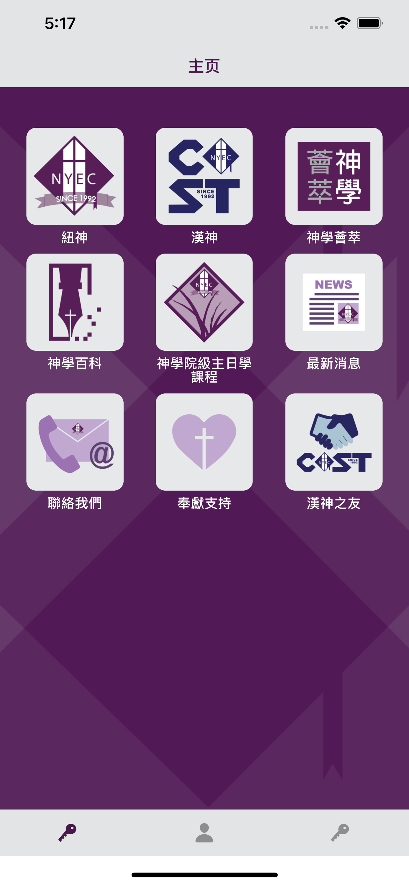
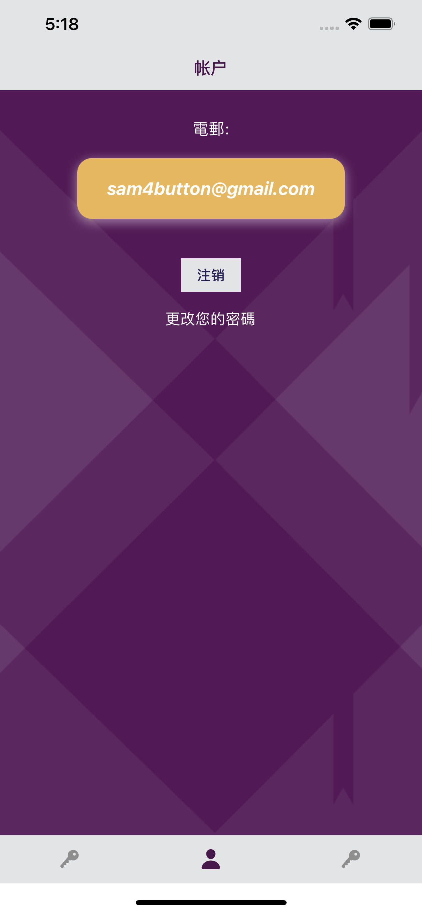
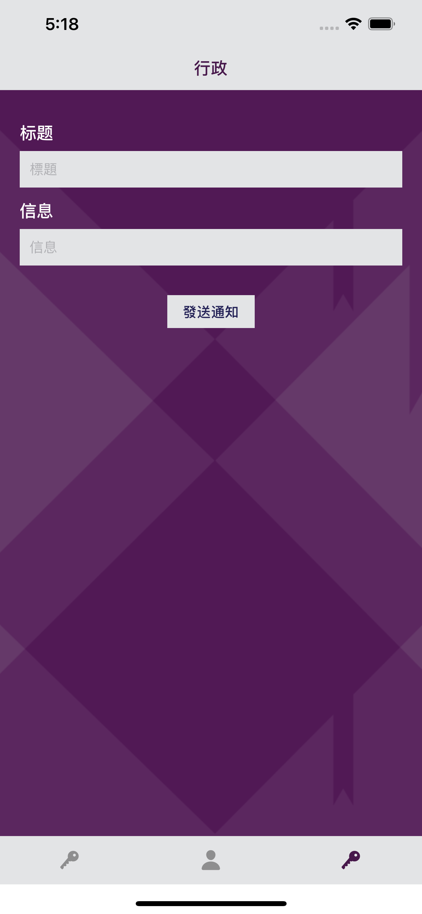

# Developer Documentation

<div>
    
    
    
</div>

## Overview
The app uses React Native (Expo) as a code framework, with <a href="https://reactnavigation.org">React Navigation</a> for app navigation and <a href="https://redux.js.org">Redux</a> for state management. Firebase is used as the backend and database.

## Main Screen
The Main Screen relies on two main components: `ButtonList` and `Button`. The `ButtonList` is a simply a list of buttons—either the main screen or a nested screen that is reached by clicking on one of the buttons. `Button` is an icon in its parent `ButtonList` that either leads to a nested `ButtonList` or a web link (e.g. there are 9 `Button`s in the main `ButtonList`).

### Data models
In `./data/data.js`, you can find all the data used to render the `ButtonList`s and `Button`s. The data relies on two main models in `./models/models.js`: a category model and a url model.

The category model represents holds the underlying data for a `ButtonList`. The model contains a `this.children` property, which represents the icons of `Button`s in that list.

The url model represents an icon that, when clicked, navigates to the URL specified by `this.url`.

`ButtonList` renders a `FlatList` of `Button`s, forming a grid with three columns. Each `Button` is represented by a `category` or `url` object that will yield a different result when clicked. 

## Authentication
The authentication screen allows for three main functionalities: logging in, signing up, and resetting your password. The app largely relies on <a href="https://firebase.google.com/docs/reference/rest/auth">Firebase's REST authentication API</a>.

### Login
An API call is made to `https://identitytoolkit.googleapis.com/v1/accounts:signInWithPassword?key=${API_KEY}`, which returns an id token, the expiration time of the token, and the user id. The user id uniquely identifies the user and the id token authenticates any API requests.
These values are dispatched to Redux to be access by the application. They are also stored in `AsyncStorage` and retrieved to auto-login the user. 
It is worth mentioning that when the id token expires, API calls will not work. As such, the login credentials are not only removed from `AsyncStorage` and Redux upon expiry, but the user is also auto-logged out.

We also obtain the user's `role`, which can be `"user"` (default) or `"admin"` (which must be set from the Firebase console). `admin` access allows push notifications to be sent to users.

Expo uses push notification tokens to identify devices and send notifications to users. Upon login, the user's existing push notification tokens are obtained from Firebase, and the current device's push notification is added to that list if not already present. This way, when an admin wants to send a notification, they can query all distinct tokens and make an API call to each token.

Lastly, we check that the user has verified their email, and if not, replace the main app page with a "verify your email" screen.

### Sign up
An API call is made to `https://identitytoolkit.googleapis.com/v1/accounts:signUp?key=${API_KEY}`. 

Everything else is almost identical to logging in.

### Forgot your password
This feature is handled by the `./components/PasswordChange` component.

The user enters the email associated with their account and sends an API request to `https://identitytoolkit.googleapis.com/v1/accounts:sendOobCode?key=${API_KEY}`, which sends the email.
The email will contain a web link that the user can use to reset their password.

## Account Screen
The account screen displays the email of the currently logged in user and allows the user to log out. Logging out will clear the Redux state and any user data stored in `AsyncStorage`.

Additionally, the user can change their password, which is the same process as "Forgot your password".

## Admin Screen
Only users with `role = "admin"` have access to this page. It allows the admin to send notifications to *all* users who have registered with an email in the app.

The tokens are queried from `https://nytec-practice-default-rtdb.firebaseio.com/tokens.json?auth=${IDTOKEN_OF_ADMIN}` and placed into a unique set.
A POST API call is then made to Expo's push notification service at `https://exp.host/--/api/v2/push/send` for each token.

## Firebase
The database consists of two tables: `tokens` and `users`.

### Tokens
Sample structure:
```
tokens
    [Userid1]
        tokens
            [token1]
            [token2]
            ...
    Userid2
    ...
      
```
The `tokens` table stores a user's push notification tokens, which are sent to Expo's push notification API service when an admin creates a notification. 
The nested `tokens` variable is an array. There may be multiple tokens if a user has multiple devices.

### Users
Sample structure:
```
users
    [Userid1]
        role: "user"
    [Userid2]
        role: "admin"
    ...
```
The `users` table stores the role of each user. It is worth mentioning that the API was designed so that a user cannot set their `role` to anything but `user`. `admin` must be set from the Firebase console.


